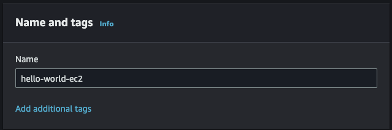
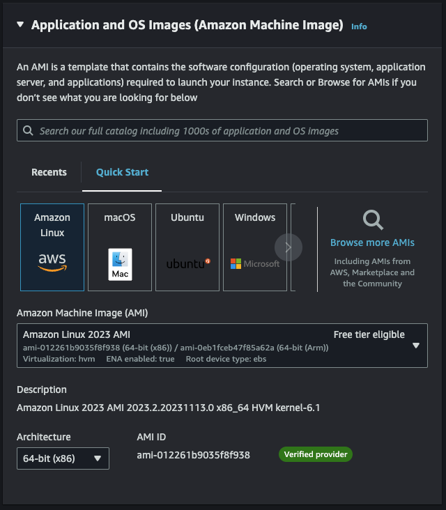
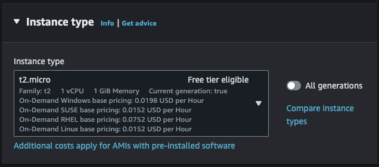
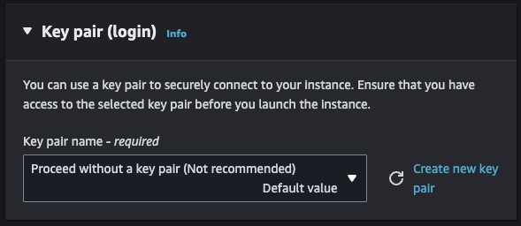
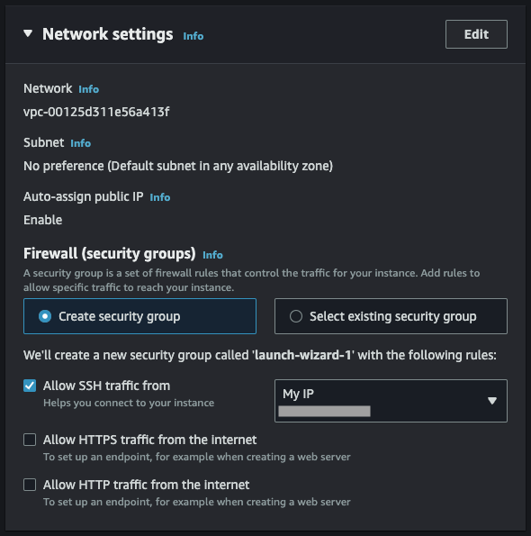
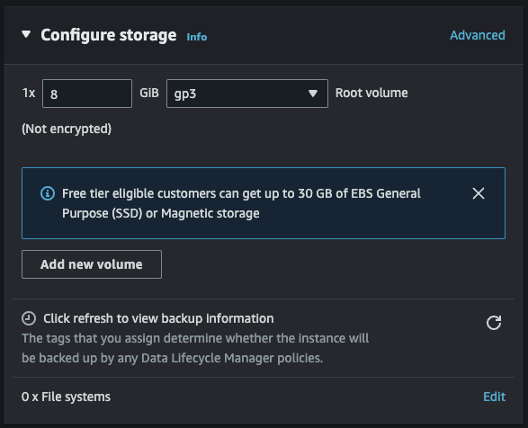

+++
title = '建立我的第一個 EC2'
date = 2023-12-01T20:55:22+08:00
draft = false
categories = ['Server']
tags = ['aws', 'ec2']
+++
## 目的

紀錄建立一個 EC2 實體時的步驟，因為相較其他家 VPS 多了一些不一樣的設定，所以寫一點簡單的筆記。

## 名詞解釋

- t2-micro: EC2 的其中一種類型，t 是類型，2 是第幾代，micro 是 size。
- Security group: 用來設定資料的傳入以及傳出規則，基本上就是防火牆，只是可以套用多條到一個群組，在建立 Instance 的時候就可以直接套用多個群組。

## 步驟

1. 輸入 EC2 名稱
2. 選擇 Image or Application
3. 選擇 Instance type
4. 建立 / 選擇 Key pair for ssh login
5. 建立 / 選擇 Security group
6. 設定 Storage
7. 其他進階設定

## 實作開始

### 輸入 EC2 名稱

基本上沒什麼問題，取個你認得名字就好。

### 選擇 Image or Application

這裡有一個專有名詞叫 AMI (Amazon Machine Image)，基本上和 OS 的 Image 是一樣的東西，有各種 Linux，也有 macOS 和 Windows，可以直接選擇 Amazon Linux 就好。

### 選擇 Instance type

這個就是選擇你想要的機器規格，上面有寫 Free tier eligible 的就是可以免費使用的。

> t2-micro: EC2 的其中一種類型，t 是類型，2 是第幾代，micro 是 size。
>

### 建立 / 選擇 Key pair for ssh login

用於 SSH login 時的驗證，在這裏可以比較簡單的建立和管理，這裡的截圖雖然是選擇不使用 key pair ，但是強烈建議要打開，避免你的機器被駭客拿去挖礦。

### 建立 / 選擇 Security group

這裡就是防火牆的設定，記得打開需要的設定，一定要打開的有

1. Allow SSH traffic from
    1. 記得選 My IP 避免你的 EC2 從別的地方被駭客登入。
2. Allow HTTP / HTTPS
    1. 看你的服務需不需要 80 / 443 port。

### 設定 Storage

設定你的系統儲存空間，這個我也不太會設定，請洽鳥哥的 Linux XDD

### 其他進階設定

基本上沒有什麼需要特別設定的，除了 User data 和 IAM Instance profile。

- User data
  - 用來初始化機器用的，輸入指令就可以預先在第一次建立實體時執行指令，像是要不要先安裝好 Web server (like Apache / Nginx)，這個項目在之後的 ECS 會需要用到。
- IAM Instance profile
  - 在某些服務上會需要你選擇對的 IAM Role，才能讓別的服務正常存取你的 ec2。
