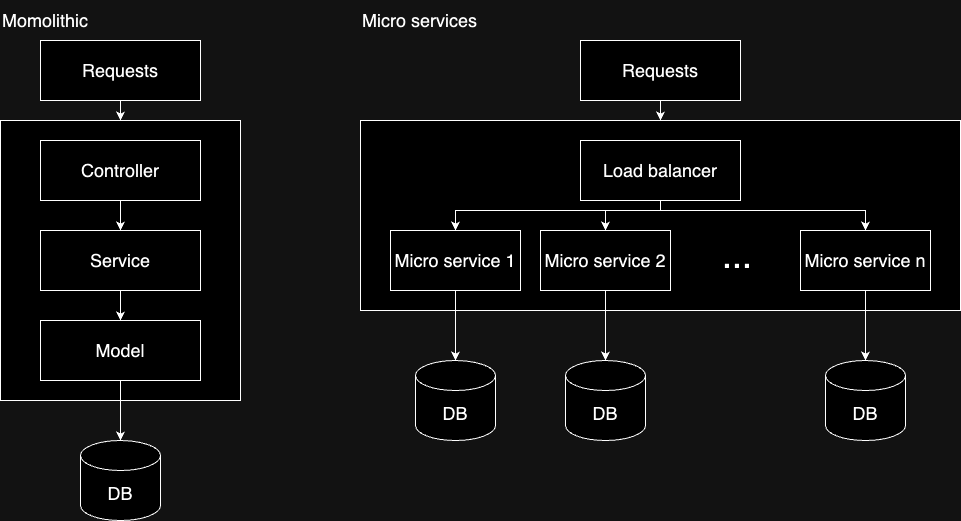
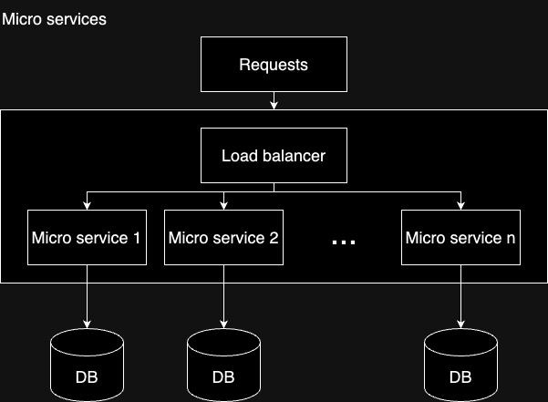
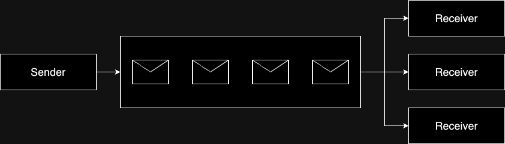

+++
title = '微服務架構設計'
date = 2024-05-20T06:35:00+08:00
draft = false
categories = ['Software Engineering']
tags = ['micro service', 'monolithic', 'load balancer', 'message queue']
+++

## 前言

微服務架構設計將單體式架構切成多個小服務，取得開發、部署以及擴容方便的優勢，今天將會簡單比較單體式架構與微服務架構，並且列舉出微服務架構中的元件，透過這些章節好好學習微服務架構。

## 單體式 vs 微服務

### 開發階段

單體式: 於開發初期具有開發快速的優勢，但是隨系統越來越複雜，在多個人員協作的狀況下，將會提高溝通成本，延緩開發速度。

微服務: 於開發初期需要更多的系統設計時間，但是在各個功能單純的微服務中開發，可以加快開發人員的開發速度，降低維護難度。

### 部署階段

單體式: 每次的新版本都需要部署一整個完整的系統，在編譯、測試、部署上都會花費大量時間，但是其中有許多不需要重新部署的元件，相當浪費資源。

微服務: 每一次的部署都是以一個微服務為單元，可以大幅加速部署時間。

### 維運階段

單體式: 當某個節點出了問題，容易影響到整個系統，無法正常提供服務。

微服務: 某個節點出了問題時，由於我們將多個系統分開來了，所以影響到的部分都是較小較單一的服務，要更新 / 修復都相當快速。

### 適用場景

單體式: 較為適用在初期較小規模團隊，或是個人開發，需要快速驗證商業價值的場景。

微服務: 適用於規模龐大的系統或是高流量的系統，將龐大的系統切分為功能明確的小單位時，提供了簡單的擴容方法以及有快速的開發 / 部署流程。

## 微服務元件

以下開始舉例各種微服務架構中會使用到的元件，用於提昇微服務的可用性，提供穩定、高效率的服務

### 負載平衡器 & 水平擴展

在高流量負載的系統上，只有一台主機負責消化所有流量是不現實的，再怎麼堆 CPU 和 RAM (垂直擴展) 都會有趕不上流量的一天，於是就出現了水平擴展的方式，就算每個人(主機)的力量很小，只要人夠多，就可以應付的來。

水平擴展需要將流量分配到所有主機，不可能手動設定，所以就有了 Load Balancer，透過一定的規則，將流量分發給各個伺服器，這樣就可以達到消化高流量的目的。

相關服務:

- Load balancer
  - EC2 Load balancer
- 水平擴展
  - EC2 Auto Scale Group

### 訊息隊列

在微服務的架構中，避免單點故障造成的整體故障是一大重點，所以導入了訊息隊列這個元件，訊息隊列透過將請求暫存在一個隊列中，再讓對應的服務去消化掉這些請求，這樣有兩個優點。

1. 平攤流量: 有了中間這個緩衝區，可以避免突發的流量直接打掛一台伺服器，伺服器可以按照他的能力處理請求。
2. 重啟請求: 第二個是當伺服器因為更新或是故障而無法處理請求時，請求也會留在隊列中，只要等到服務回復之後就可以繼續處理先前的請求，避開了剛剛所說的單點故障造成的影響。

但當然得到的不會只有優點，像是如何確保請求不會丟失、不會被處理多次、至少被處理一次都是需要考慮的問題。

相關服務

- Simple Queue Service
- Amazon MQ

## 結語

透過微服務可以取得許多好處，但同時也帶來了學習成本以及架構設計的挑戰，但是多多學習一定有好處的，遇到不同的場景時可以提出更多的想法以及解決方案。
