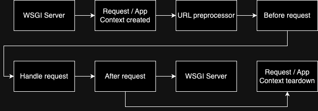

+++
title = 'Flask 生命週期 - Flask life cycle'
date = 2024-05-21T09:43:12+08:00
draft = false
categories = ['Backend']
tags = ['Python', 'Flask', "WSGI"]
aliases = ['/posts/python/2024_05_21_python_life_cycle/', '/posts/python/2024_05_21_python_life_cycle/index.html']
+++

## 前言

完全不懂 Flask life cycle 我們也可以使用 Flask 建立出一個完整的系統，但是瞭解了之後，我們可以將各種資源的調度放在 Flask life cycle 的各個節點中，這樣可以讓整個系統更有條理，以下內容皆整理自 Flask 官方文件，我也會寫一個範例 Repo 幫助讀者更有效地理解 Flask life cycle。

<https://flask.palletsprojects.com/en/3.0.x/lifecycle/>

## Flask handle request with WSGI server

以下步驟節錄自 Python 官方文件

1. Browser or other client makes HTTP request.
2. WSGI server receives request.
3. WSGI server converts HTTP data to WSGI `environ` dict.
4. WSGI server calls WSGI application with the `environ`.
5. Flask, the WSGI application, does all its internal processing to route the request to a view function, handle errors, etc.
6. Flask translates View function return into WSGI response data, passes it to WSGI server.
7. WSGI server creates and send an HTTP response.
8. Client receives the HTTP response.

簡單說明: WSGI server 負責接收來自 Client 端的請求(step 1, 2)，再將請求轉成 Python 可以執行的內容(step 3~5)，讓 Python 處理完之後的內容打包 http response (step 6, 7)回應請求端(step8)。

## Flask life cycle

接下來就進入重點了，這篇文章我想著重在理解 life cycle 上，所以這裡我會簡單講解整個流程。

1. WSGI server 呼叫 Flask
2. Flask 建立 Request 和 App Context 物件
    - Request Context 紀錄 Request 層級的內容，包含從 WSGI server 帶過來的 request 和 session。
    - App Context 紀錄 app 層級的內容，像是 Flask 實體本身 current_app，以及其他全域變數 g。
3. 將 Request 和 App Context 物件存到 Local Context
    - Local Context 以 Thread 為範圍，讓 Flask 可以儲存一些 life cycle 中會用到的資訊
4. 預處理 URL Value
    - 透過 URL value preprocessor 可以為後續的節點服務，像是資料型態的預處理這類事情。
5. before request
    - 在進到 Handler 之前與之後的時機點，可以在這個時候處理 session。
6. 按照路由讓應該接收請求的 handler 處理請求並回傳 Response
7. after request
    - 在這裡可以在 Response 離開 Flask 之前，最後調整 Response 內容，Response 就會回傳給 WSGI server 並回傳給 Client side。
8. request /  app context tear down
    - 簡單來說就是在 request 結束時，將前面建立的 Request / App context 的資源給釋放掉

這裡附上一個我寫的簡單程式，讓大家可以參考一下各個 signal 與 function 被呼叫的時間點，就這樣就可以將對應的資源操作放進對應的節點。

<https://github.com/antony0016/flask-lifecyle>

## 結語

透過完整了解 Flack 的生命週期之後，我們可以有更多優化效能以及提升可維護性的著手點，像是可以在 before request 建立資料庫連線，並且在 after request 關閉資料庫連線，將程式各層好好切開，可以更好地維護我們的程式碼。
