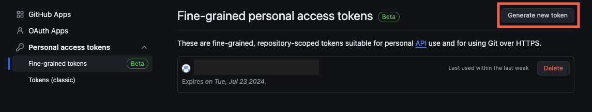
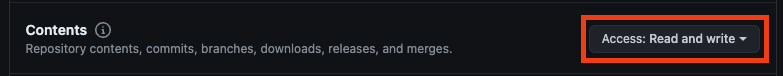
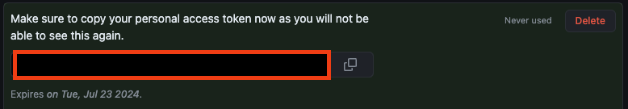
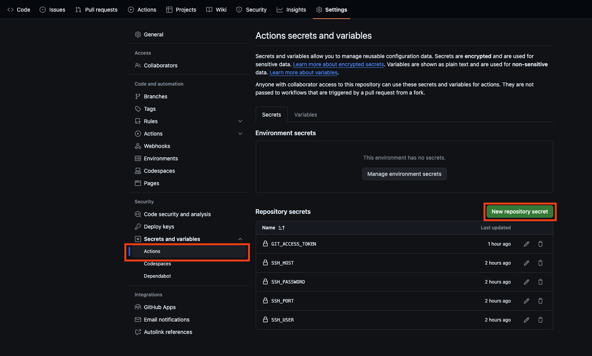
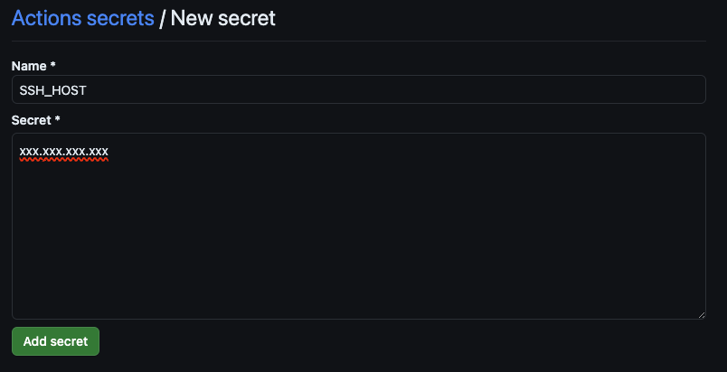
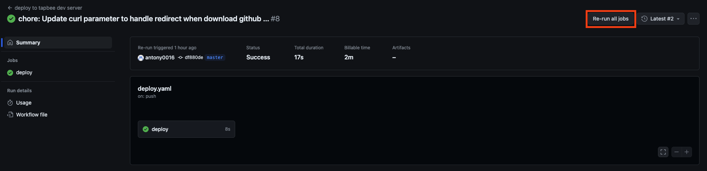
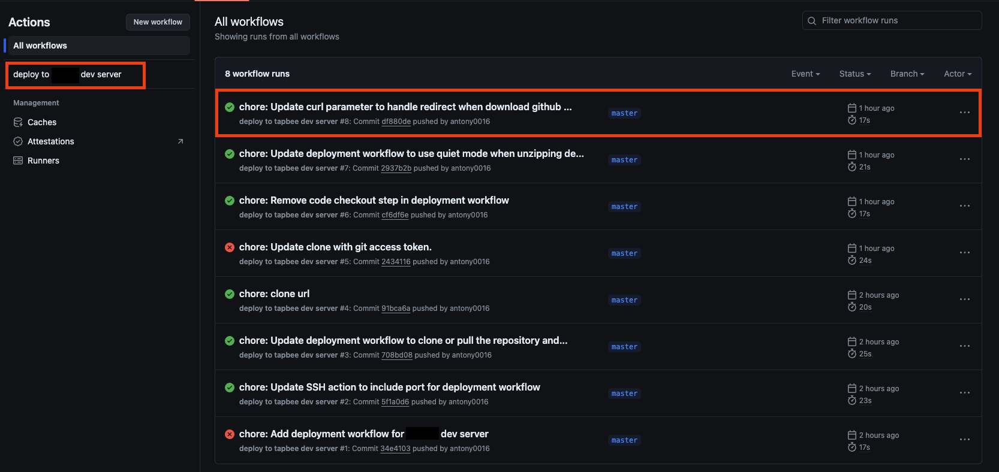

+++
title = 'GitHub Actions 部署專案到伺服器上'
date = 2024-05-24T13:36:49+08:00
draft = false
categories = ['CI/CD']
tags = ["github actions", "ci/cd", "ssh"]
+++

## 前言

今天嘗試用了 GitHub Actions 把我的部署過程自動化，由於這個專案 ~~pay 太少了~~只是單次活動使用的靜態網頁，不需要測試，所以這次會專注在部署上。

## 步驟

- 建立 access token
- 建立 workflow
- 建立 secret 保管機敏資料
- 優化探討

## 建立 access token

為了方便你建立 token，我直接把連結幫你點好放在下面了，不用謝 😊

<https://github.com/settings/tokens?type=beta>



點進去右上角的 Generate new token，然後填妥 Token name, 過期時間，並且選擇要可以操作哪些 repository，為了安全性請盡量不要使用 All repositories 的選項，再到下面的 Repository permissions 中找到 Contents，將 No access 改成 Read and write，這樣就可以透過 token 直接 clone private repository 而不需登入。




建立完成之後會回到前一頁，我們就可以看到 token 是什麼了，直接複製起來留著後面使用。



## 建立 Secret 管理機敏資料

請直接參考下面的 code，在專案根目錄建立 .github/workflows/deploy.yaml

```yaml
# work flow 的名字
name: deploy to dev server

# 表示在 master 這個分支被推送 commit 的時候
# 會執行這個 workflow
on:
  push:
    branches:
      - master

jobs:
  # 定義我們的 job
  # job 會包含好幾個 step
    deploy:
      # 定義這個 job 要跑在使用 ubuntu 的 runner 上
        runs-on: ubuntu-latest
    
      # 開始寫這個 job 的操作步驟
        steps:
         
         # 這個 step 用到了 appleboy 大大寫的 ssh-action@v1.0.3
         # 用來連上我們自己的開發伺服器進行操作
        - name: Deploy
          uses: appleboy/ssh-action@v1.0.3
          with:
           # 寫入資訊告訴 ssh-action 要連線的參數
           # ${{ secrets.XXX }} 會帶入等等在 github 上設定的那些機敏資訊
            host: ${{ secrets.SSH_HOST }}
            port: ${{ secrets.SSH_PORT }}
            username: ${{ secrets.SSH_USER }}
            password: ${{ secrets.SSH_PASSWORD }}
            # 接下來就是正常我們會在 server 上進行的那些操作了
            # | for multiline script
            script: |
                cd /home/dev
                # 檢查 repo 資料夾是否存在，不在的話使用 clone
                # 已經 clone 過就使用 pull 更新伺服器上的檔案
                if [ ! -d "<repo-name>" ]; then
                    git clone https://${{ secrets.GIT_ACCESS_TOKEN }}@github.com/<username>/<repo-name>.git
                    cd <repo-name>
                else
                    cd <repo-name>
                    git pull
                fi
                cd /home/dev
                # 檢查是否成功，成功才繼續下一步處理相依性套件/函式庫下載
                if [ ! -d "<repo-name>" ]; then
                    exit 1
                fi
                # 進到對應的資料夾，用 curl 下載套件/函式庫
                cd ./<repo-name>/lib/
                if [ ! -d "bootstrap-5.3.3-dist" ]; then
                    mkdir bootstrap-5.3.3-dist
                    curl -o bs.zip -sL https://github.com/twbs/bootstrap/releases/download/v5.3.3/bootstrap-5.3.3-dist.zip
                    unzip -q bs.zip
                    rm -f bs.zip
                fi
                    
```

都寫完貼上之後直接 commit 並推上 GitHub 就可以了，到 repo 裡你應該會直接看到 actions 出錯的訊息，接下來我們就把 workflow 中用到的 secret 填到 repo 中。

## 建立 secret 保管機敏資料

按照下圖，新建一個新的 secret。



然後填入剛剛有用到的 SSH_HOST 進 Name, 以及對應 IP 進 Serect 中，之後的 SSH_PORT, SSH_USER, SSH_PASSWORD 以及 GIT_ACCESS_TOKEN 就按照一樣的步驟建立就完成了。



我們可以點到上面的 Action 之後選擇我們的 workflow 點進去最新一次執行紀錄。



點擊 Re-run all jobs，就可以套用剛剛建立的 secret 實際連上 server 進行操作了。



## 問題探討

從我這次的 workflow 檔案中可以看到，都是很簡單的 bash 腳本，但是只做了少少的錯誤檢查，在其他需要長期維護的專案中，為了更穩健的提供服務，我們應該做好更多的錯誤檢查及測試。

像是這次的建立過程中我就遇到了 curl 下載檔案出了問題，但是由於有下載了一個空檔案，所以 workflow 跑起來看起來是正確的狀況發生，一定要多注意！

## 結語

本來想說只是 Hello world 級別的專案，應該不會有什麼問題，結果 GitHub Action 上的確沒什麼問題，在 Bash 腳本和 curl 的使用上，倒是遇到了一些問題XD，藉機讓我可以好好重新認識這兩個常用的工具。
