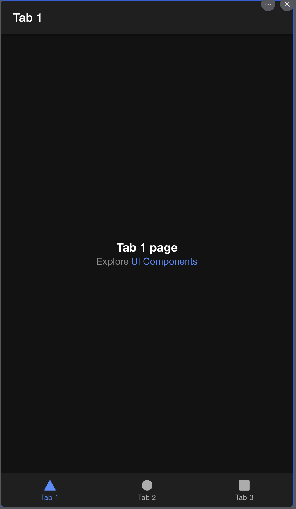

+++
title = '初識 Ionic'
date = 2024-04-22T00:12:03+08:00
draft = false
categories = ['Frontend']
tags = ['ionic']
+++

## 前言

由於專案用途需要使用到 Ionic 這個框架，這個框架可以用前端三大框架 (Angular, React, Vue)為基底進行開發很好上手，所以想把學習的過程做個筆記，這篇會從建立到運行開發環境做個介紹，編譯部分之後再寫XD

官網供參 <https://ionicframework.com/>

## 步驟

1. 下載 Ionic CLI
2. 建立新的 Ionic 專案
3. 在本機測試預覽

## Step 1 - 下載 Ionic CLI

先使用 NPM 在全域安裝 Ionic CLI，這會在後面用於建立專案與運行專案使用。

```bash
npm install -g @ionic/cli
```

## Step 2 - 建立新的 Ionic 專案

輸入下列指令，然後按照 CLI 提供的步驟

```bash
ionic start
# Use app creation wizard? n
# => 也可以選 Y，但就會使用網頁去建立一個新的 Repo

# Framework: Vue
# => 選擇要使用的前端框架

# Project name: sample-ionic
# => 專案名稱，隨便輸入就好~

# Starter template: tabs
# 這裡他會給你四個選項，建議第一次碰 Ionic 可以選 tabs 看看一些基本的用法
```

選擇完各種選項之後，安裝完各種依賴後，專案就建立完成了。

## Step3 - 在本機測試預覽

首先進到目錄，然後用 Ionic CLI 將專案 run 起來。

在瀏覽器中打開 <http://localhost:8100> 就可以預覽剛剛建立好的專案了

```bash
cd sample-ionic
ionic serve
```

如果都照這篇輸入指令建立，應該就會看到以下的畫面了



## 結語

建立過程相當簡單，下一篇先介紹如何部署到手機上進行測試，畢竟這是為了開發 App 用的框架，不知道怎麼部署的話，也沒用武之地。
